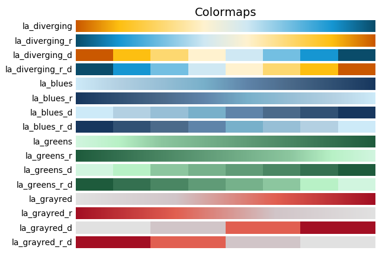

# Los Angeles Citywide Data Style

Styling and themes for data science projects in the City of Los Angeles,
following the style guide documented [here](https://cityoflosangeles.github.io/best-practices/charting.html).

This contains a Python package which can be installed and imported.
Upon import, it enables a custom matplotlib 
[style sheet](https://matplotlib.org/gallery/style_sheets/style_sheets_reference.html).

It also includes a set of color maps which can be specified in various matplotlib charts.


## Installation

This package may be installed with
```bash
pip install los-angeles-citywide-data-style
```


## Usage

You can use it by importing it:
```python
import los_angeles_citywide_data_style
```
After import, the above color maps will be registered, and can be referenced by their names.